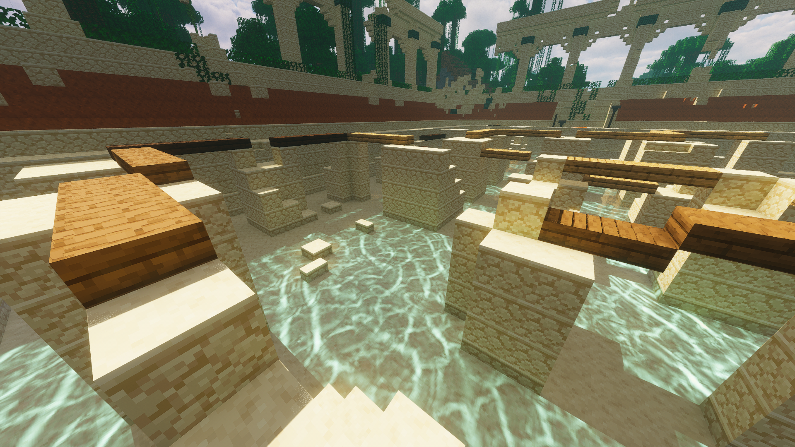

  

<h1 align = "center">Photon GAMS</h1>

A gameplay-focused shader pack for Minecraft based on Photon by Sixthsurge

## Acknowledgments

* OUdefie17 (Mod support, Colored Light settings, Some features)
* Arona74  (Mod support, Transfer to new versions of Photon, Owner of the dev branch)
* -Daytendo64- (Galaxy, Nebula, Shooting Stars, End Solar Flare settings, More cloud types, Transfer to 1.3 rc1)
* sw-52 (More Tonemap Operators and settings, Fog settings, DOF settings)
* Miclus (Some screen-space effects, Visibility Bitmask Indirect Lighting, Transfer to voxy support, Translate zh_CN)

### Downloads
* [Latest commit](https://github.com/Miclus/Photon-GAMS/archive/refs/heads/main.zip)

## Features

* Better Hardcoded Emission
* More customization options
* More settings for Colored Light, Water, Sky, Fog
* Better support for mods
* More Tonemap Operators
* Visibility Bitmask Indirect Lighting (High quality SSAO + SSGI at extremely low cost)
* More Cloud Types
* More Nether/End Effects

## Compatibility
### GPU vendors
* Nvidia 
* AMD 
* Intel 
* **_NOT_** Apple Metal
  * You may be able to get the shader pack to work by disabling some settings: try _SH Skylight_ and _Colored Shadows_.
### Shader loaders
* Iris - version 1.5 and above
* OptiFine - on Minecraft 1.16.5 and above
### Special mod support
* [Distant Horizons](https://www.curseforge.com/minecraft/mc-mods/distant-horizons)
* [Voxy](https://modrinth.com/mod/voxy)
* [Photonics](https://modrinth.com/mod/photonics)

## Community

- For questions, suggestions and news regarding this shader pack, head to [Photon discord server thread](https://discord.com/channels/1007736612488220724/1288402151097499698)
- You can also [give money to sixthsurge which is the original photon developer](https://ko-fi.com/sixthsurge) if you want to 